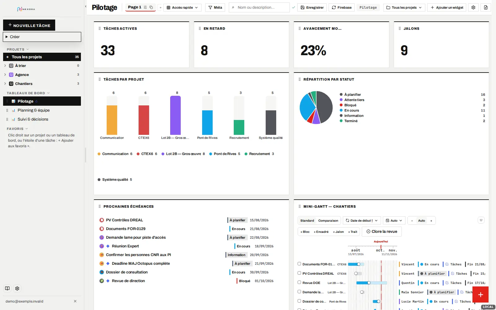
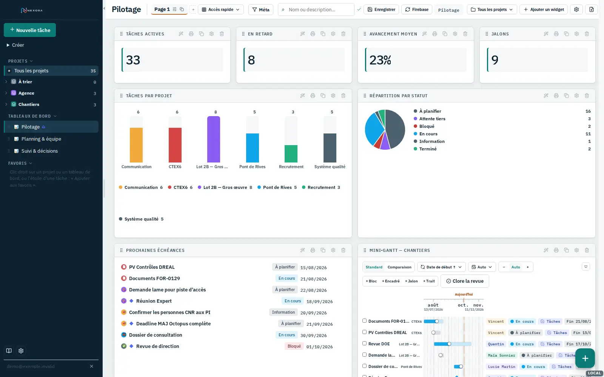
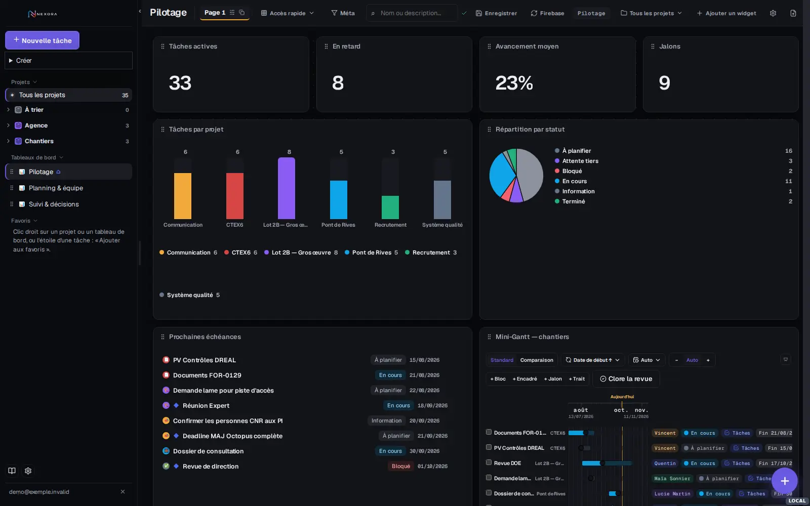
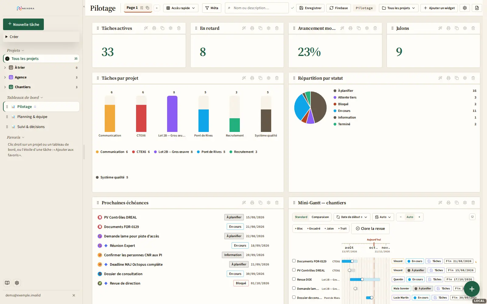
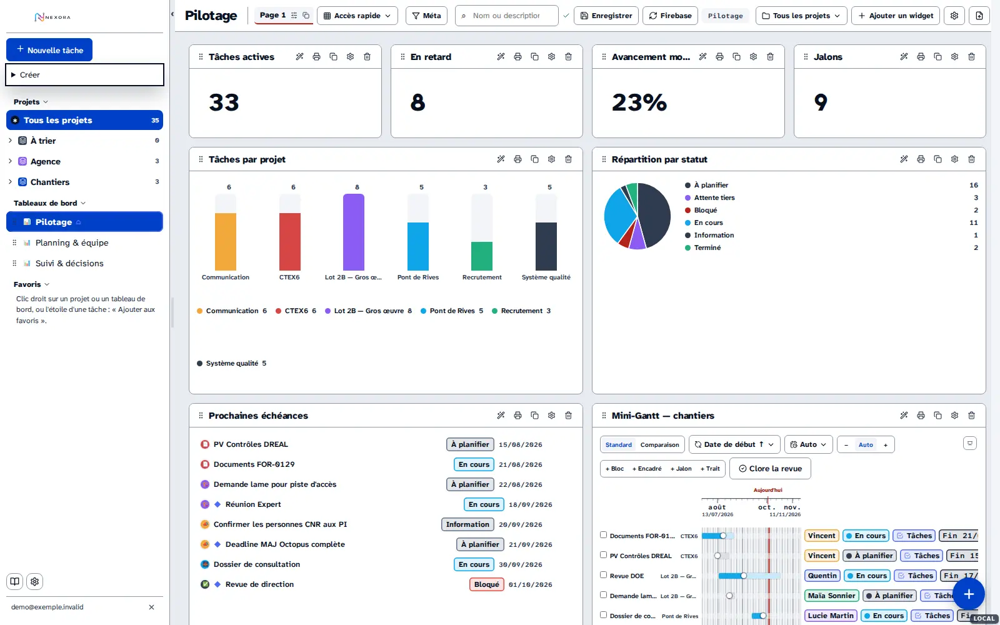
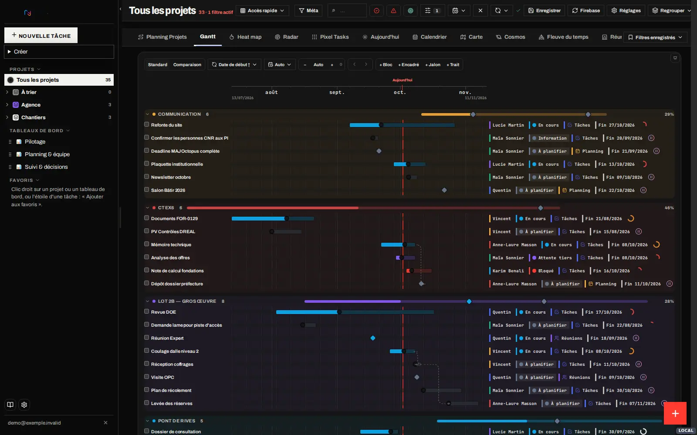
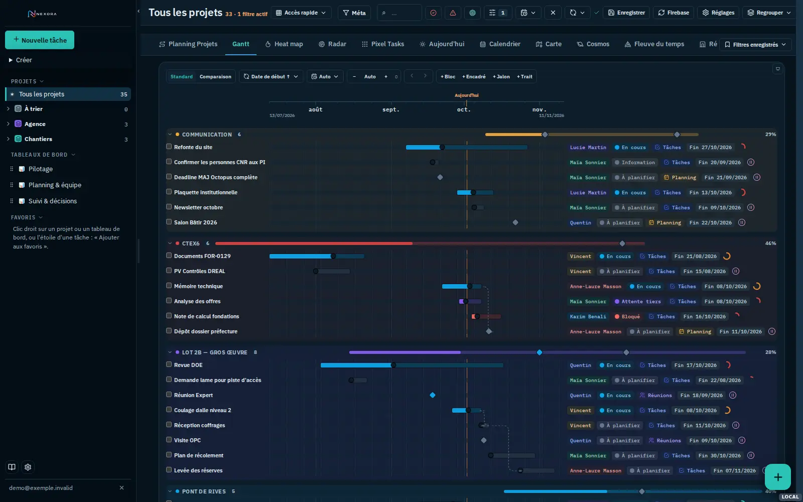
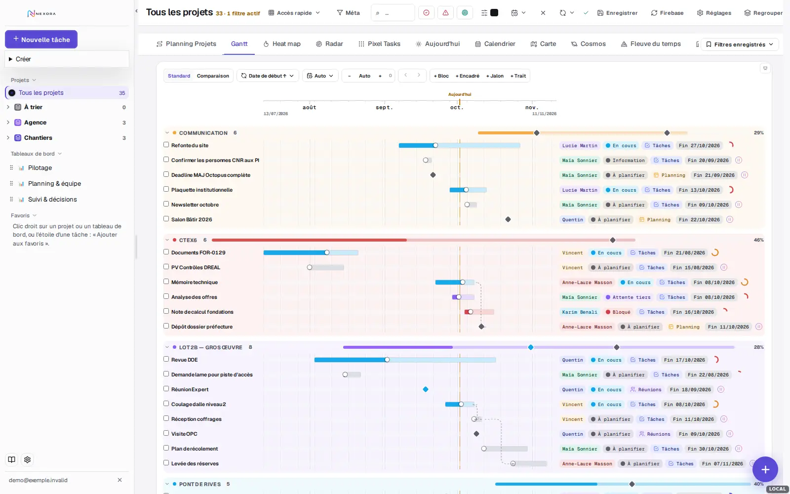
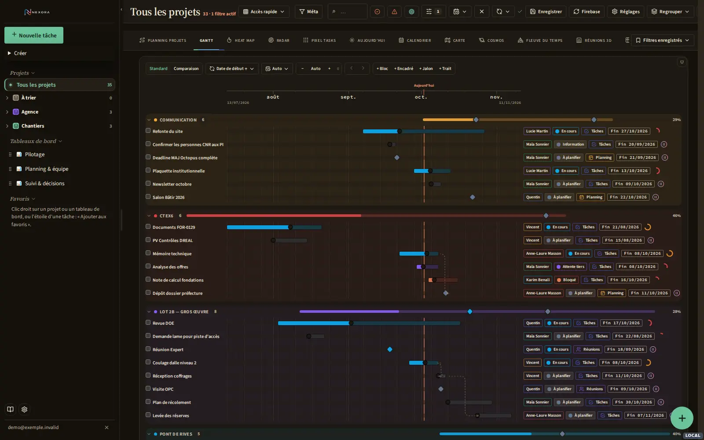
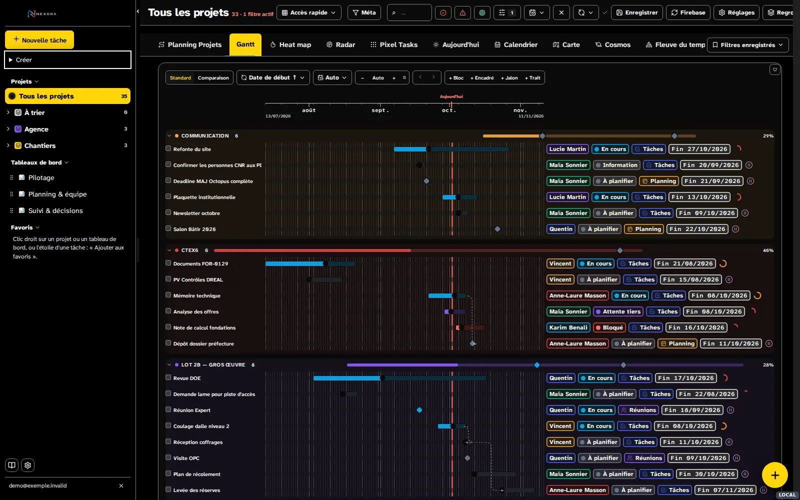

# Chartes graphiques Nexora — cinq propositions

Étude de l'esthétique de Nexora et cinq chartes graphiques complètes, toutes appliquées à
l'application réelle **sans modifier le moteur** : ni composant, ni donnée, ni comportement.
Chaque charte est une feuille CSS autonome qui se pose par-dessus l'existant et propose deux
thèmes (clair et sombre).

Galerie : [`index.html`](index.html) (ouvrir localement) · captures de la charte actuelle :
[`reference/`](reference/).

| | Charte | Idée directrice | Accent | Typographie | Défaut | Dossier |
|---|---|---|---|---|---|---|
| 01 | **Signal** | Rigueur suisse : encre, papier, un seul signal rouge | encre `#111111` + rouge `#E2231A` | Archivo · JetBrains Mono | clair | [CHARTE.md](01-signal/CHARTE.md) |
| 02 | **Atlas** | Cartographie marine : rail marine, sarcelle, balise ambre | sarcelle `#0A7A76` | IBM Plex Sans / Condensed / Mono | clair | [CHARTE.md](02-atlas/CHARTE.md) |
| 03 | **Nocturne** | Console de pilotage sombre, violet électrique, chrome effacé | violet `#6A5AE0` | Geist · Geist Mono | **sombre** | [CHARTE.md](03-nocturne/CHARTE.md) |
| 04 | **Édition** | Registre éditorial : ivoire, serif, filets doubles, vert forêt | vert `#1E5E44` | Source Serif 4 · Source Sans 3 | clair | [CHARTE.md](04-edition/CHARTE.md) |
| 05 | **Clarté** | Lisibilité maximale : Atkinson, AAA, focus jaune, haut contraste | cobalt `#0040C8` / jaune `#FFD60A` | Atkinson Hyperlegible Next | clair | [CHARTE.md](05-clarte/CHARTE.md) |

| Signal | Atlas | Nocturne | Édition | Clarté |
|---|---|---|---|---|
|  |  |  |  |  |
|  |  |  |  |  |

Chaque dossier contient : intention, principes, palette (SVG + tableau des tokens, deux
thèmes), contrastes WCAG mesurés, typographie et échelle, formes et profondeur, règles par
composant, à faire / à éviter, limites, 9 vues et 15 widgets capturés dans chaque thème,
mise en œuvre.

## 1. Étude de la charte actuelle

Sources : `GlobalStyles` (`apps/nexora/source/index.html.part-001`, ≈ 7 200 lignes de CSS),
la couche finale `life-suite-visual-system-v1` (fin de `part-003` et `part-004`), les feuilles
Finance/Sport, et le CSS effectivement chargé, extrait du navigateur (CSSOM) sur 9 vues.

**Ce qui fonctionne et que les cinq chartes conservent**

- Inter et chiffres tabulaires ; surfaces bordées ; hiérarchie par le contraste d'encre.
- Les couleurs de données (projets, statuts, personnes, types) sont portées par les données :
  elles ne sont jamais remplacées par une charte.
- La densité (`lp-density-compact`), les grilles et tailles sauvegardées des widgets.

**Constats**

| Constat | Mesure |
|---|---|
| Deux systèmes de tokens superposés : `.lp-theme` (« Le Plan », gris vert `#EFF1F0`, orange `#FF7A3D`) puis `life-*` (bleu `#245EDB`, gris bleu `#F3F5F9`) qui le recouvre. | Deux accents coexistent : le bleu pour l'action, l'orange pour le focus, l'onglet actif et « aujourd'hui ». |
| Couleurs codées en dur malgré les tokens. | 1 206 déclarations colorées littérales dans le CSS chargé (dont 120 blancs et 25 `#245EDB`), ≈ 1 670 couleurs littérales dans le JSX. |
| Aucun thème sombre possible par simple changement de tokens. | Fonds `#fff` codés en dur, aplats « encre » (`background: var(--ink)` avec texte `#fff`) qui s'inversent mal. |
| Puces (statut, projet, personne) en texte coloré sur teinte à 13 %. | Contraste de 1,8:1 (orange `#F2A93B`) à 4,0:1 ; **aucune** n'atteint 4,5:1. |
| Barre supérieure chargée. | Une douzaine de commandes de même poids visuel sur un tableau de bord. |
| Widgets bruyants. | 5 icônes d'action permanentes par widget, poignées de redimensionnement visibles aux quatre coins. |
| Indicateurs (KPI) sans hiérarchie. | Chiffre enfermé dans un second cadre à l'intérieur de la carte, sans libellé distinct. |

## 2. Méthode — « sans toucher au moteur »

Chaque feuille `nexora-<charte>.css` est générée par [`outils/gen.mjs`](outils/gen.mjs) et
comprend quatre couches, toutes limitées à `:root[data-charte="…"]` :

1. **Tokens** `--c-*` par thème, câblés sur les tokens existants (`--life-*`, `--bg`,
   `--surface`, `--text-*`, `--accent`, `--signal`, `--ink`, `--radius*`, `--font-*`).
2. **Remappage généré** des couleurs codées en dur. Chaque couleur littérale du CSS de
   Nexora est classée en OKLCH (neutre, famille de l'accent, couleur de donnée, ombre) et
   reprojetée sur la palette du thème selon son rôle (fond, texte, bordure, ombre). Les
   couleurs de données restent intactes en clair et ne sont que rééquilibrées en sombre.
   Environ 440 à 480 règles par thème.
3. **Socle commun** ([`outils/base.css`](outils/base.css)) : navigation, onglets, commandes,
   widgets, champs, fenêtres, tableaux, curseurs.
4. **Signature** de la charte ([`outils/signatures/`](outils/signatures/)) : typographie,
   traitement des puces, des KPI et des en-têtes de widgets, formes.

Activation : `<html data-charte="atlas" data-mode="sombre">` + feuille + polices.

Le traitement des puces illustre la méthode : sans toucher au JSX, la propriété
`-webkit-text-fill-color` donne l'encre du texte tandis que `currentColor` garde la couleur
de donnée pour le repère (barre, contour ou teinte de fond).

| Contraste des puces (7 couleurs de données de la démo) | min. | max. |
|---|---|---|
| Actuel | 1,8:1 | 4,0:1 |
| Atlas (teinte + encre à parts égales) | 5,2:1 | 7,9:1 |
| Nocturne sombre / clair | 7,3:1 / 6,2:1 | 9,9:1 / 10,0:1 |
| Signal, Édition, Clarté (texte en encre) | ≥ 15:1 | — |

## 3. Captures — protocole

Captures de l'application réelle : build `local` (`npm run local`, données fictives), jeu de
démonstration enrichi (6 projets en 2 dossiers, 35 tâches, 6 personnes, dépendances,
3 tableaux de bord de 4 à 8 widgets), Chromium 1600 × 1000, 2 octobre 2026. 9 vues et
15 widgets par thème, soit 52 captures par charte et 26 pour la référence actuelle.
Banc : [`outils/capture.mjs`](outils/capture.mjs), données : [`outils/seed.mjs`](outils/seed.mjs).

## 4. Recommandation

- **Atlas** comme charte principale : c'est l'évolution la plus directe de l'existant (même
  structure claire, un seul accent au lieu de deux), avec une identité nette (rail marine)
  et une lecture des chiffres améliorée (mono).
- **Nocturne** comme thème sombre de référence si un mode sombre est souhaité : c'est la
  seule charte conçue d'abord pour le sombre.
- **Clarté** en option d'accessibilité, indépendante de la charte principale.
- **Signal** et **Édition** sont des directions plus affirmées : à retenir si l'on veut
  rompre avec l'existant (Signal pour la densité et l'impression, Édition pour un usage de
  lecture et de direction).

Deux corrections valent pour n'importe quelle charte, y compris l'actuelle : le traitement
lisible des puces et le masquage des actions de widget hors survol.

## Limites communes

- **Hors périmètre :** les vues 3D (Carte, Cosmos, Fleuve du temps, Réunions 3D) gardent leurs
  palettes propres (moteurs WebGL) ; la page de connexion et les modules Devis, Factures et
  Finance PRO n'ont pas été capturés.
- **Couleurs calculées en JavaScript :** certaines couleurs sont produites par le code et non
  par le CSS, par exemple le dégradé des curseurs d'avancement (`sliderGradientBg`,
  `#EAEDF3`) ou le texte des tuiles de treemap. Elles ne suivent pas le thème : en sombre, la
  piste des curseurs est neutralisée et la poignée porte la valeur.
- **Remappage par instantané :** il couvre le CSS extrait des vues visitées. Un nouveau
  composant avec des couleurs littérales demandera de régénérer
  (`outils/donnees/css-colors.json`). Une adoption définitive devrait plutôt remplacer ces
  littéraux par des tokens dans le code : c'est le seul vrai correctif.
- **Thèmes sombres :** ce sont des propositions crédibles, pas des thèmes audités écran par
  écran. Des fenêtres et menus rares n'ont pas été vérifiés.
- Le logo PNG est inversé par filtre sur les navigations sombres ; une version vectorielle
  claire serait préférable.

## Reproduire

```bash
npm run build:local && node scripts/serveur-local.mjs --sans-build   # http://127.0.0.1:8888
node docs/chartes-graphiques/outils/gen.mjs        # régénère outils/sortie/<charte>.css
node docs/chartes-graphiques/outils/dossier.mjs    # régénère CHARTE.md et palettes SVG
# captures : node outils/capture.mjs <dossier> <feuille.css> "data-charte=atlas,data-mode=clair" "" "<url polices>"
```

`outils/lib.mjs` suppose Playwright installé globalement et un proxy sortant ; adapter le
chemin d'import et le lancement de Chromium à la machine.
