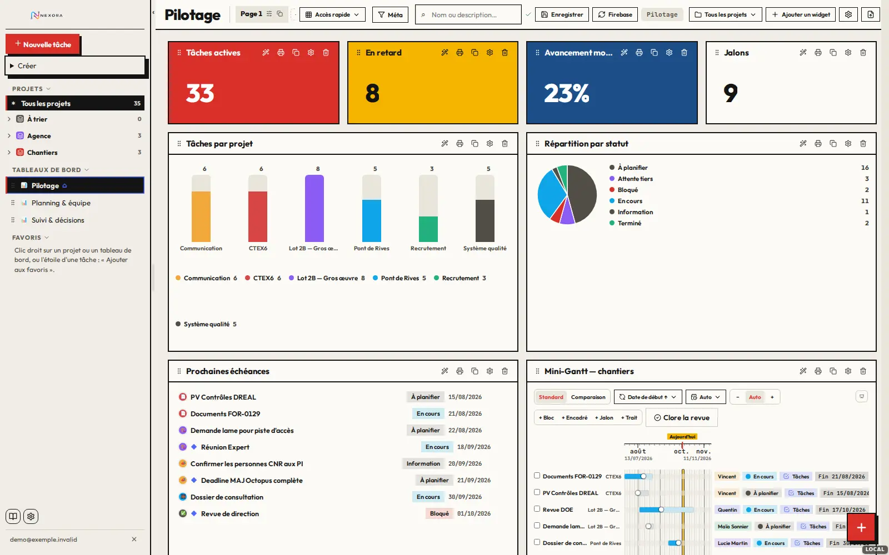
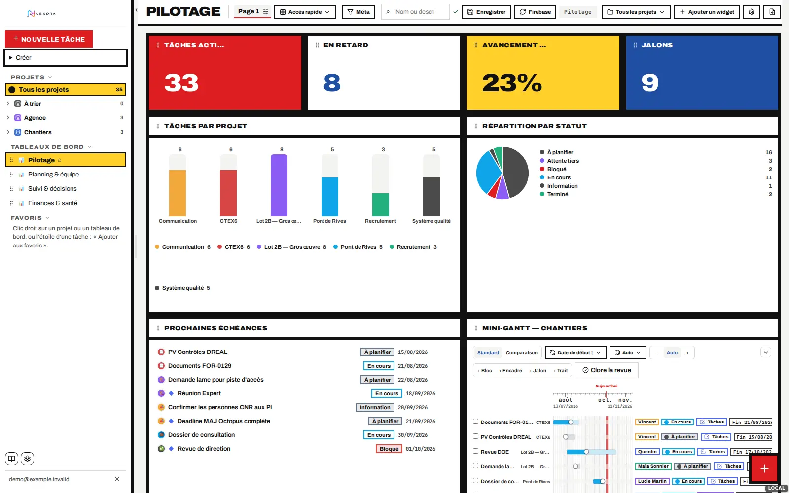
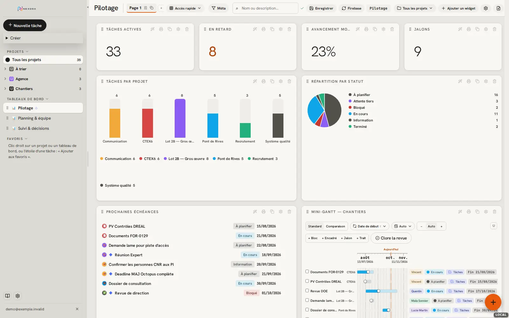
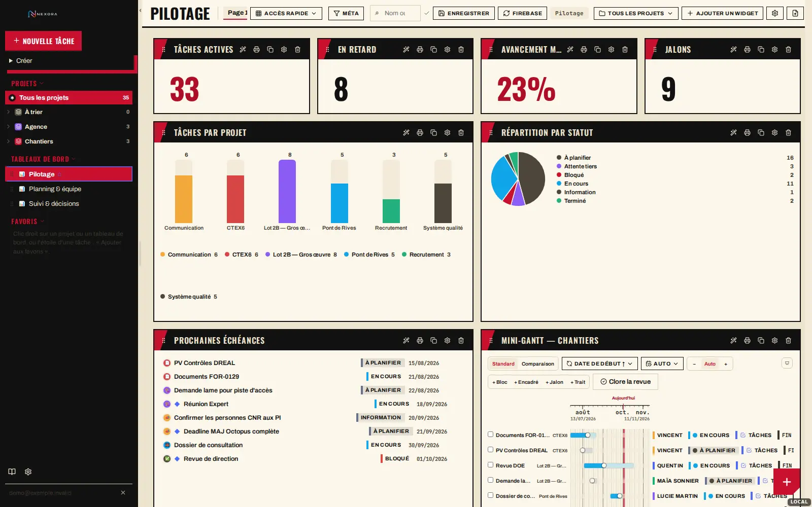
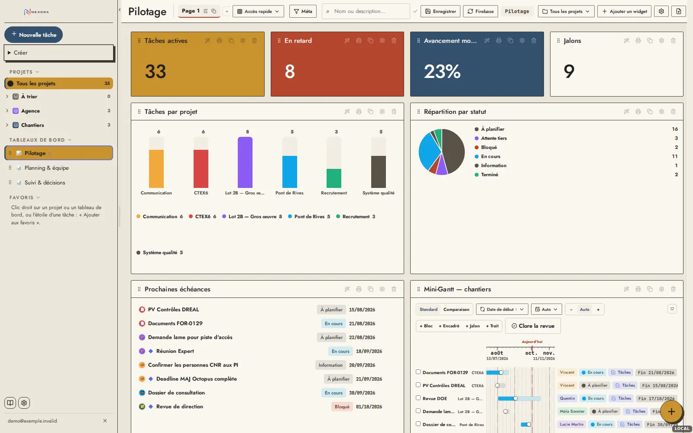
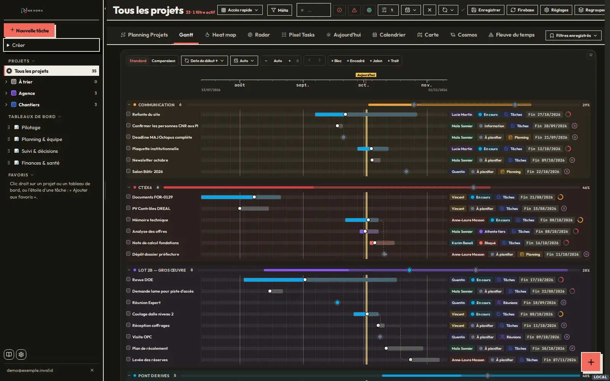
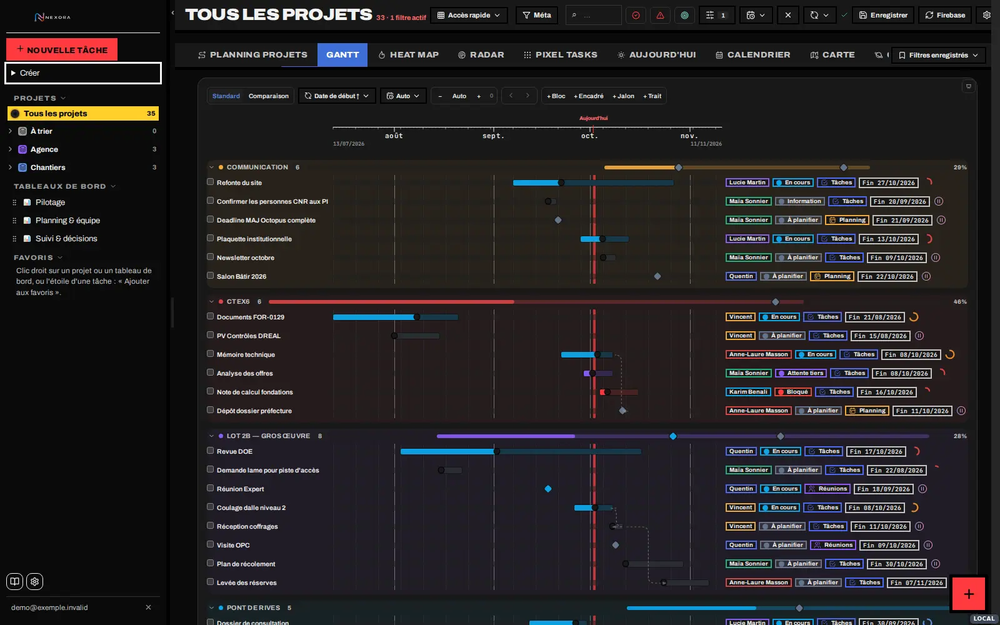
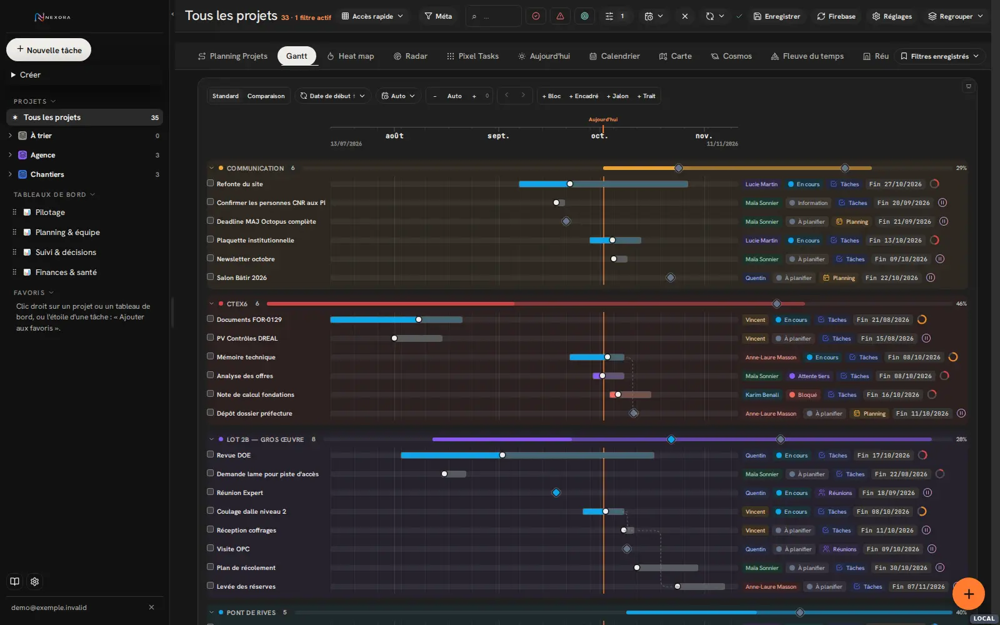
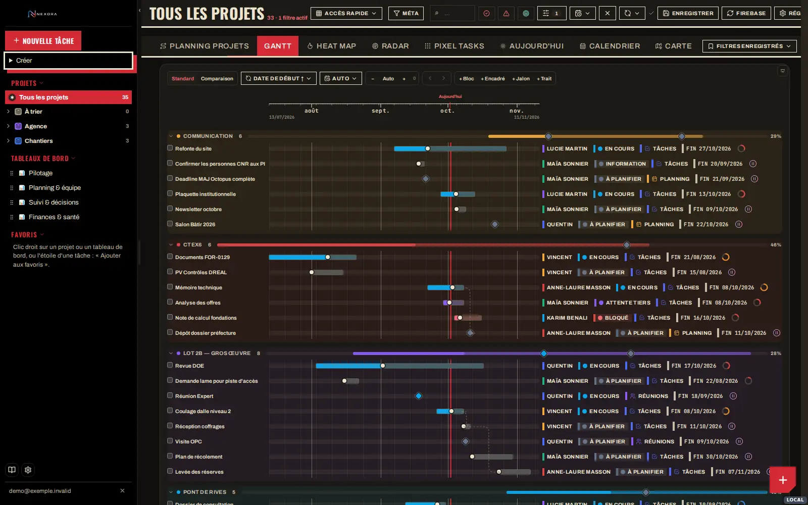
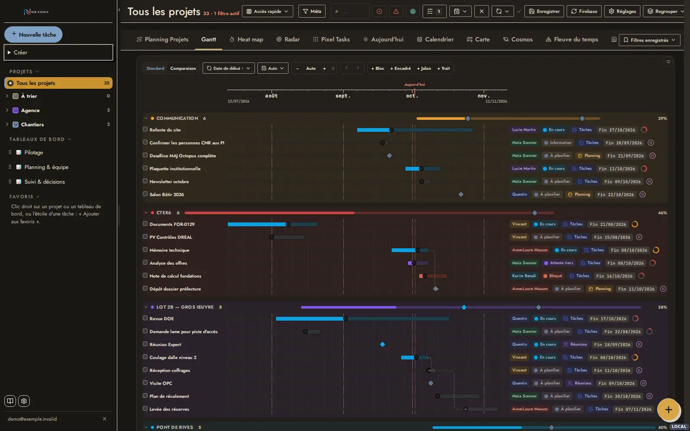

# Chartes graphiques Nexora — famille Bauhaus

Le thème **Bauhaus** de la page « Budget prévisionnel » adapté à Nexora, et quatre variantes de la
même famille (modernisme graphique). Chaque charte est une feuille CSS autonome qui se pose sur
l'application **sans modifier le moteur** et propose deux thèmes, clair et sombre.

**Thèmes sombres (Ref #625) : [`sombres/`](sombres/README.md)** — dix propositions, audit de contraste des graphiques.
**Intégration (Ref #621) :** Bauhaus et Dessau sont activables dans Réglages → Apparence ; couche générée par [`outils/integration.mjs`](outils/integration.mjs).

Galerie : [`index.html`](index.html) (ouvrir localement) · captures de la charte actuelle :
[`reference/`](reference/). Une première série de cinq propositions (Signal, Atlas, Nocturne,
Édition, Clarté) a été écartée ; elle reste dans l'historique git.

| | Charte | Idée directrice | Couleurs d'aplat | Typographie | Dossier |
|---|---|---|---|---|---|
| 01 | **Bauhaus** | La page budget : papier, cadres noirs 2 px, tuiles rouge / jaune / bleu | `#D9302A` `#F5B400` `#1D4E89` | Outfit | [CHARTE.md](01-bauhaus/CHARTE.md) |
| 02 | **De Stijl** | Toile de Mondrian : grille noire épaisse entre les widgets, aplats primaires | `#DD1D21` `#FFD02A` `#1F4FA3` | Archivo élargie | [CHARTE.md](02-destijl/CHARTE.md) |
| 03 | **Ulm** | Appareil Braun : gris chaud, noir, un seul orange, pilules et cercles | `#E8590C` | Hanken Grotesk | [CHARTE.md](03-ulm/CHARTE.md) |
| 04 | **Constructiviste** | Affiche de Rodtchenko : crème, noir, rouge, bandeaux d'encre et diagonales | `#C8102E` | Oswald + Archivo | [CHARTE.md](04-constructiviste/CHARTE.md) |
| 05 | **Dessau** | Bauhaus tempéré : ocre, brique, ardoise, filets 1,5 px, Futura | `#C9922E` `#B5462E` `#34506E` | Jost | [CHARTE.md](05-dessau/CHARTE.md) |

| Bauhaus | De Stijl | Ulm | Constructiviste | Dessau |
|---|---|---|---|---|
|  |  |  |  |  |
|  |  |  |  |  |

Chaque dossier contient : source et intention, principes, palette (SVG et tableau des tokens,
deux thèmes, aplats propres), contrastes WCAG mesurés, typographie et échelle, formes, règles par
composant, à faire / à éviter, limites, 9 vues et 15 widgets capturés dans chaque thème, mise en
œuvre.

## 1. Étude de la charte actuelle

Sources : `GlobalStyles` (`apps/nexora/source/index.html.part-001`, ≈ 7 200 lignes de CSS),
la couche finale `life-suite-visual-system-v1` (fin de `part-003` et `part-004`), les feuilles
Finance/Sport, et le CSS effectivement chargé, extrait du navigateur (CSSOM) sur 9 vues.

**Ce qui fonctionne et que les cinq chartes conservent**

- Inter et chiffres tabulaires ; surfaces bordées ; hiérarchie par le contraste d'encre.
- Les couleurs de données (projets, statuts, personnes, types) sont portées par les données :
  elles ne sont jamais remplacées par une charte.
- La densité (`lp-density-compact`), les grilles et tailles sauvegardées des widgets.

**Constats**

| Constat | Mesure |
|---|---|
| Deux systèmes de tokens superposés : `.lp-theme` (« Le Plan », gris vert `#EFF1F0`, orange `#FF7A3D`) puis `life-*` (bleu `#245EDB`, gris bleu `#F3F5F9`) qui le recouvre. | Deux accents coexistent : le bleu pour l'action, l'orange pour le focus, l'onglet actif et « aujourd'hui ». |
| Couleurs codées en dur malgré les tokens. | 1 206 déclarations colorées littérales dans le CSS chargé (dont 120 blancs et 25 `#245EDB`), ≈ 1 670 couleurs littérales dans le JSX. |
| Aucun thème sombre possible par simple changement de tokens. | Fonds `#fff` codés en dur, aplats « encre » (`background: var(--ink)` avec texte `#fff`) qui s'inversent mal. |
| Puces (statut, projet, personne) en texte coloré sur teinte à 13 %. | Contraste de 1,8:1 (orange `#F2A93B`) à 4,0:1 ; **aucune** n'atteint 4,5:1. |
| Barre supérieure chargée. | Une douzaine de commandes de même poids visuel sur un tableau de bord. |
| Widgets bruyants. | 5 icônes d'action permanentes par widget, poignées de redimensionnement visibles aux quatre coins. |
| Indicateurs (KPI) sans hiérarchie. | Chiffre enfermé dans un second cadre à l'intérieur de la carte, sans libellé distinct. |

## 2. Méthode — « sans toucher au moteur »

Chaque feuille `nexora-<charte>.css` est générée par [`outils/gen.mjs`](outils/gen.mjs) et
comprend quatre couches, toutes limitées à `:root[data-charte="…"]` :

1. **Tokens** `--c-*` par thème, câblés sur les tokens existants (`--life-*`, `--bg`,
   `--surface`, `--text-*`, `--accent`, `--signal`, `--ink`, `--radius*`, `--font-*`).
2. **Remappage généré** des couleurs codées en dur. Chaque couleur littérale du CSS de
   Nexora est classée en OKLCH (neutre, famille de l'accent, couleur de donnée, ombre) et
   reprojetée sur la palette du thème selon son rôle (fond, texte, bordure, ombre). Les
   couleurs de données restent intactes en clair et ne sont que rééquilibrées en sombre.
   Environ 440 à 480 règles par thème.
3. **Socle commun** ([`outils/base.css`](outils/base.css)) : navigation, onglets, commandes,
   widgets, champs, fenêtres, tableaux, curseurs.
4. **Signature** de la charte ([`outils/signatures/`](outils/signatures/)) : typographie,
   traitement des puces, des KPI et des en-têtes de widgets, formes.

Activation : `<html data-charte="bauhaus" data-mode="sombre">` + feuille + polices.

Le traitement des puces illustre la méthode : sans toucher au JSX, la propriété
`-webkit-text-fill-color` donne l'encre du texte tandis que `currentColor` garde la couleur
de donnée pour le repère (barre, contour ou teinte de fond).

Contraste des puces sur les 7 couleurs de données de la démo : aujourd'hui 1,8 à 4,0:1 ;
Bauhaus, De Stijl et Constructiviste posent le texte en couleur d’encre ; Ulm 5,7 à 8,4:1 et
Dessau 5,8 à 7,9:1 (teinte de donnée mélangée à l'encre).

## 3. Captures — protocole

Captures de l'application réelle : build `local` (`npm run local`, données fictives), jeu de
démonstration enrichi (6 projets en 2 dossiers, 35 tâches, 6 personnes, dépendances,
3 tableaux de bord de 4 à 8 widgets), Chromium 1600 × 1000, 2 octobre 2026. 9 vues et
15 widgets par thème, soit 52 captures par charte et 26 pour la référence actuelle.
Banc : [`outils/capture.mjs`](outils/capture.mjs), données : [`outils/seed.mjs`](outils/seed.mjs).

## 4. Comment choisir

- **Bauhaus** : identique à la page budget, pour l'unité entre vos outils.
- **Dessau** : le même esprit en plus doux, pour un usage de toute la journée.
- **Ulm** : la plus calme et la plus classique des cinq.
- **De Stijl** et **Constructiviste** : les plus spectaculaires, pour les tableaux de bord de
  direction et l'affichage mural.

Les tuiles colorées des indicateurs (Bauhaus, De Stijl, Dessau) suivent l'ordre des widgets
dans le tableau de bord : 1er, 2e, 3e, 4e indicateur.

## Limites communes

- **Hors périmètre :** les vues 3D (Carte, Cosmos, Fleuve du temps, Réunions 3D) gardent leurs
  palettes propres (moteurs WebGL) ; la page de connexion et les modules Devis, Factures et
  Finance PRO n'ont pas été capturés.
- **Couleurs calculées en JavaScript :** certaines couleurs sont produites par le code et non
  par le CSS, par exemple le dégradé des curseurs d'avancement (`sliderGradientBg`,
  `#EAEDF3`) ou le texte des tuiles de treemap. Elles ne suivent pas le thème : en sombre, la
  piste des curseurs est neutralisée et la poignée porte la valeur.
- **Remappage par instantané :** il couvre le CSS extrait des vues visitées. Un nouveau
  composant avec des couleurs littérales demandera de régénérer
  (`outils/donnees/css-colors.json`). Une adoption définitive devrait plutôt remplacer ces
  littéraux par des tokens dans le code : c'est le seul vrai correctif.
- **Thèmes sombres :** ce sont des propositions crédibles, pas des thèmes audités écran par
  écran. Des fenêtres et menus rares n'ont pas été vérifiés.
- Le logo PNG est inversé par filtre sur les navigations sombres ; une version vectorielle
  claire serait préférable.

## Reproduire

```bash
npm run build:local && node scripts/serveur-local.mjs --sans-build   # http://127.0.0.1:8888
node docs/chartes-graphiques/outils/gen.mjs        # régénère outils/sortie/<charte>.css
node docs/chartes-graphiques/outils/dossier.mjs    # régénère CHARTE.md et palettes SVG
# captures : node outils/capture.mjs <dossier> <feuille.css> "data-charte=atlas,data-mode=clair" "" "<url polices>"
```

`outils/lib.mjs` suppose Playwright installé globalement et un proxy sortant ; adapter le
chemin d'import et le lancement de Chromium à la machine.
